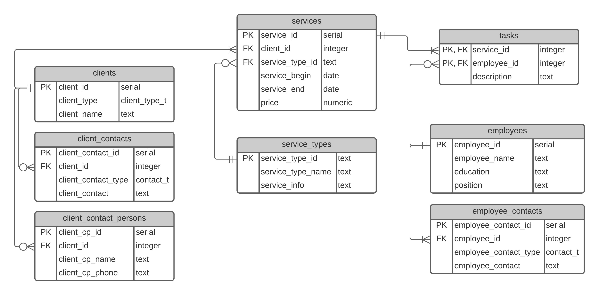
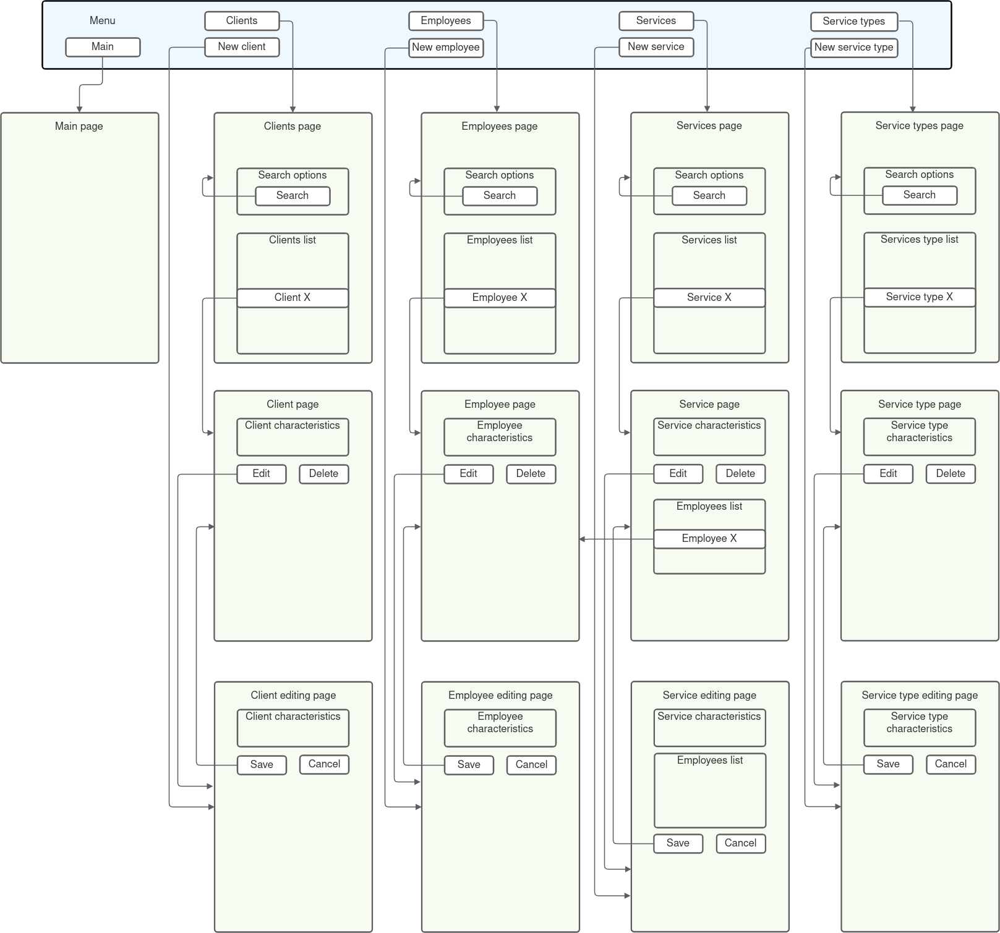

# Практикум по Web-технологиям
Задача: Разработать небольшое Web-приложение.

Тема: Клиентская база юридической фирмы. Система управления информацией о клиентах и оказываемых им услугах.

## Схема БД

contact_person_t - составной тип с полями cp_name и cp_phone.

client_type_t - перечислимый тип с возможными значениями 'person' и 'organization'.

service_type_id - поле текстового типа, потому что для типов предлагаемых услуг хочется иметь осмысленный уникальный код.

## Описание страниц
На схеме страниц изображены связи между страницами, основные элементы страниц, а также меню, которое должно присутствовать на каждой странице.

На **Странице клиентов** в списке клиентов будут отображаться уникальный идентификатор, тип (организация или физ.лицо), имя (название огранизации или ФИО) и телефоны. При этом поиск будет возможен по всем полям таблицы clients, а также по информации об оказанных услугах.

На **Странице служащих** в списке служащех будут отображаться уникальный идентификатор, ФИО, должность и телефоны. При этом поиск будет возможен по всем полям таблицы employees, а также по информации об услугах, в которых сотрудник был задействован.

На **Странице клиента**/**Странице служащего** будут отображаться все поля таблицы clients/employees, а также список услуг, оказанных этому клиенту/в которых был задействован этот сотрудник, аналогичный списку на **Странице услуг**.

На **Странице услуг** в списке услуг будут отображаться код типа услуги, имя клиента, даты начала и конца оказания услуги.

На  **Странице услуги** будут отображаться все поля таблицы services, а также имена клиента и типа услуги, соответствующие внешним ключам. Также будет отображаться список работников, задействованных в оказании этой услуги: для каждого работника будет указан идентификатор, имя и описание того, что он делал (из таблицы tasks).

На **Странице типов услуг** в списке типов услуг будут отображаться код услуги и её название.
На **Странице типа услуг** помимо этого будет дополнительная информация об услуге (из поля service_info).

## Сценарии использования
1. Просмотр списка клиентов (служащих, оказанных услуг или типов услуг)
  * Просмотр всего списка:
    * Нажать в меню *Клиенты* (*Служащие*, *Услуги* или *Типы услуг*) → **Страница клиетнов** (**Страница служащих**, etc.), на которой отображается список всех клиентов (служащих, etc.) и основная информация о них.
  * Просмотр списка клиентов (служащих, etc.), удовлетворяющих некоторым условиям:
    * Нажать в меню *Клиенты* (*Служащие*, etc.) → **Страница клиетнов** (**Страница служащих**, etc.), заполнить форму для поиска и нажать *Поиск* → **Страница клиетнов** (**Страница служащих**, etc.), на которой отображается список подходящих клиентов (служащих, etc.) и основная информация о них.
2. Манипуляции с информацией о клиенте (служащем, оказанной услуге или типе услуг)
  * Просмотр подробной информации о клиенте (служащем, etc.):
    * Найти в списке клиентов на **Странице клиентов** (можно воспользоваться поиском, как описано в п.1) интересующего клиента и нажать на него (или кнопку рядом с ним, или ещё как-то, конкретный способ будет определён позже) → **Страница клиента** с подробной информацией о нём.
    * На **Странице клиента** и **Странице служащего** (но не **Странице услуги** и **Странице типа услуги**) также отображается список всех услуг, оказанных этому клиенту / в оказании которых принимал участие этот служащий. Этот список ведёт себя также, как список на **Странице услуг**: возможен поиск по нему и переход на **Страницу услуги** выбранной услуги, но он отображает только те услуги, которые были оказаны этому клиенту/в оказании которых принимал участие этот служащий.
    * На **Странице услуги** также отображается список задействованных служащих, с возможностью перехода на **Страницу служащего**.
  * Изменение информации о клиенте (служащем, etc.):
    * Попасть на **Страницу клиента** (как описано в подпункте "Просмотр подробной информации..."), нажать *Редактировать* → **Страница редактирования клиента**, изменить нужные поля и нажать *Сохранить* → (в случае успешного сохранения изменений) **Страница клиента**, на которой отображена изменённая информация.
    * В случае неуспеха: ... нажать *Сохранить* → **Страница редактирования клиента** с отображением возникших ошибок.
    * На **Странице редактирования клиента** (служащего, etc.) также можно нажать *Отменить* → **Страница клиента** (служащего, etc.), на которой отображена старая информация, до последнего успешного сохранения изменений.
    * На **Странице редактирования услуги** (только на ней) можно изменять список зедействованных служащих и описание их задач в рамках оказания этой услуги.
  * Удаление клиента (служащего, etc.) из базы данных:
    * Попасть на **Страницу клиента** (как описано в подпункте "Просмотр подробной информации..."), нажать *Удалить* → подтвердить удаление → **Главная страница** в случае успешного удаления.
    * В случае неуспеха: ... нажать *Удалить* → подтвердить удаление → сообщение об ошибке.
  * Добавление в базу данных нового клиента(служащего, etc.):
    * Нажать в меню *Добавить клиента* → **Страница редактирования клиента**, изменить нужные поля и нажать *Сохранить* → (в случае успешного сохранения изменений) **Страница клиента**, на которой отображена внсённая информация о новом клиенте.
    * В случае неуспеха: ... нажать *Сохранить* → **Страница редактирования клиента** с отображением возникших ошибок.
